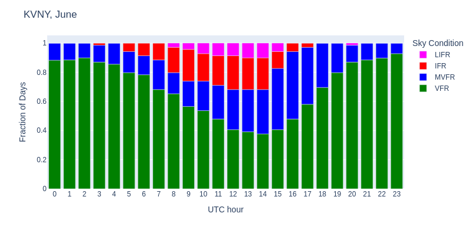

# METAR Predictor

A web application and command-line tool that predicts hourly airport weather conditions based on historical METAR data patterns. Perfect for pilots who want to get a sense for weather patterns at unfamiliar airports.

**Live demo:** [https://www.avmapper.com/metars](https://www.avmapper.com/metars)

## Why?

Have you ever planned a flight into a coastal airport and wondered, "What time will this marine layer burn off if I fly in next week?" TAFs only go out a day or two in advance. If you're planning an itinerary for next week or next month, it's hard to know what to expect.

This predictor solves that problem by analyzing several years of historical METAR data to show you typical weather patterns for any month at airports with available data.
It generates a stacked bar chart, one bar for each hour of the day, color-coded by flight condition.

### Example: Santa Monica vs Van Nuys in June

I learned to fly in Santa Monica, which is near the coast and frequently subject to
marine layers. The analyzer shows this:


- At hour 0 UTC (5 PM local), VFR extends from 0 to 0.70, meaning 70% of days had VFR conditions
- By hour 8 UTC (1 AM local), VFR drops to just 27%, with a 73% chance of marine layer
- Worst hours are 13-14 UTC (6-7 AM local): only 22-27% VFR, with 73-78% marine layer
- Best conditions are 20-23 UTC (1-4 PM local): 76-87% VFR

Our typical backup was Van Nuys, just 14 miles away but usually with better conditions due to being protected from the marine layer by the Santa Monica Mountains:



- Best VFR: 19 UTC through 6 UTC (noon through 11 PM local) at 79-93%
- At worst hours (13-14 UTC / 6-7 AM local), VFR is still ~40%—significantly better than KSMO's ~25%

## How It Works

The predictor downloads several years of historical METAR data from the [Iowa Environmental Mesonet ASOS network](https://mesonet.agron.iastate.edu/request/download.phtml) for your selected airport and month, then calculates the fraction of observations that fall into each flight condition for each hour of the day.

Flight conditions are determined by ceiling and visibility, with the more restrictive condition defining the overall flight condition:

| Condition | Ceiling | Visibility |
|-----------|---------|------------|
| **VFR** | ≥ 3,000 ft AGL | ≥ 5 statute miles |
| **MVFR** | ≥ 1,000 and < 3,000 ft AGL | ≥ 3 and < 5 statute miles |
| **IFR** | ≥ 500 and < 1,000 ft AGL | ≥ 1 and < 3 statute miles |
| **LIFR** | < 500 ft AGL | < 1 statute mile |

## Usage

I split the predictor's core logic out into a separate library so it could be used
in two ways: as both a web application and a command-line tool.

### Command-Line Tool

Generate a weather prediction chart for an airport as PNG, with optional text output:

```bash
# Basic usage - generates KSMO-06.png
./cli/metar_analyzer.py --airport KSMO --month 6

# Specify custom output filename
./cli/metar_analyzer.py --airport KVNY --month 8 --output van_nuys_august.png

# Print statistics table to stdout (in addition to generating PNG)
./cli/metar_analyzer.py --airport KPAO --month 8 --print-table
```

**Options:**
- `-a, --airport` - Airport ICAO code (e.g., KSMO, KPAO)
- `-m, --month` - Month number (1-12)
- `-o, --output` - Output filename (default: `<AIRPORT>-<MONTH>.png`)
- `--print-table` - Print hourly statistics table to stdout

### Web Application

The web application is simple: an input box with month and airport name. The airport name auto-completes based on a database I constructed of all airports that have weather data available: it's the intersection of the list of all stations from the [Iowa Environmental Mesonet](https://mesonet.agron.iastate.edu/) and
the airport database from [OurAirports](https://ourairports.com/data/). A script finds stations that appear in both databases and emits a list to a JSON file that the web front-end loads to drive the autocomplete feature.


## Data Sources
- [Iowa Environmental Mesonet](https://mesonet.agron.iastate.edu/) - Historical METAR data (~67,000 stations)
- [OurAirports](https://ourairports.com/data/) - Airport database (80,000+ airports)
